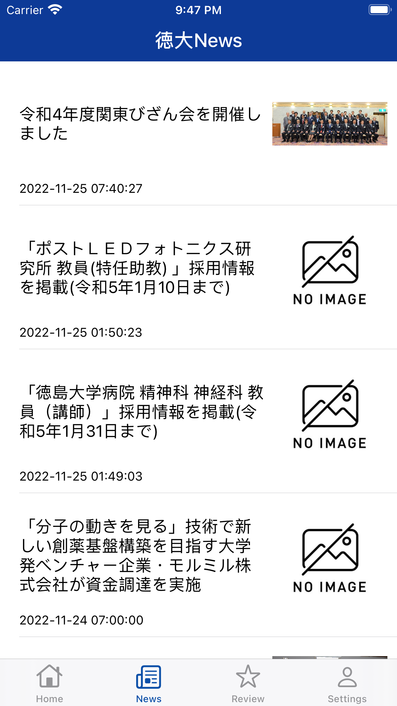
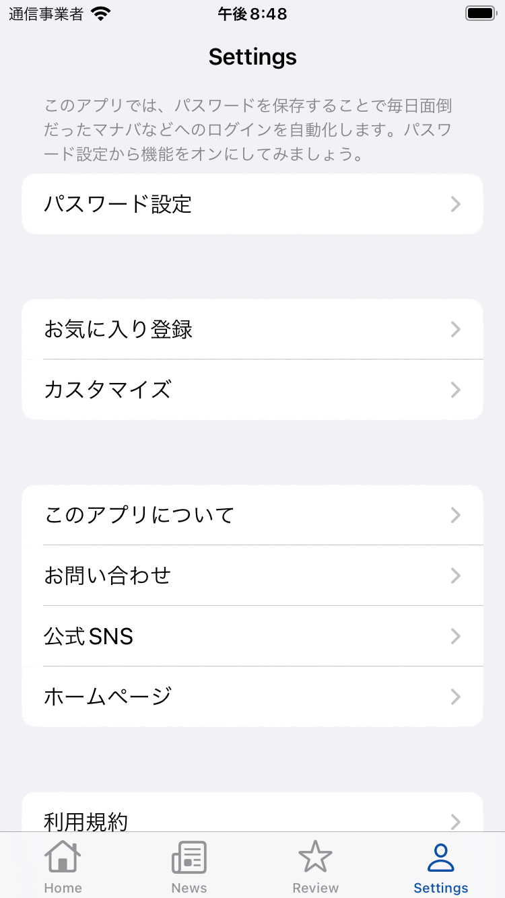
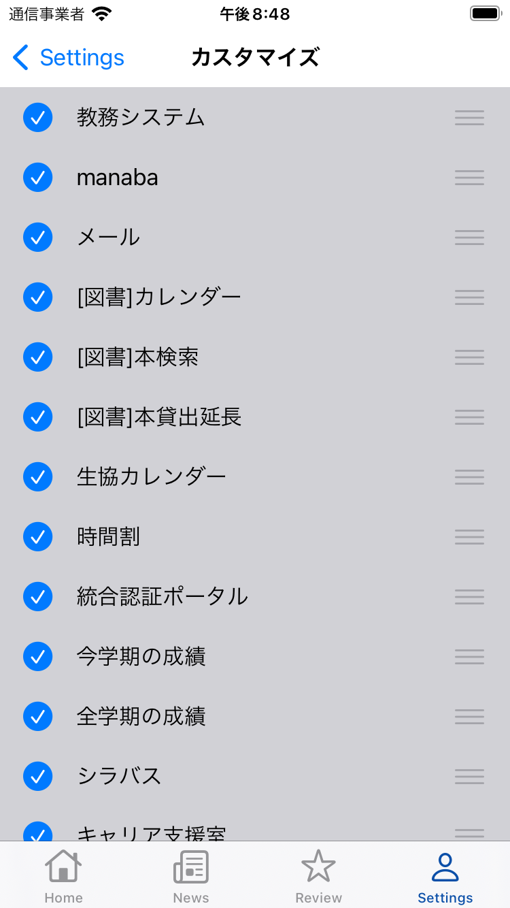

# トクメモ＋ (TokumemoPlus) for iOS

<!-- [](https://github.com/tokudai0000/univIP/release/latest) -->

[](https://github.com/tokudai0000/univIP/blob/main/LICENSE)
[](https://github.com/tokudai0000/univIP)
[](https://twitter.com/tokumemo0000)

|Branch|CI|
|:--|:--|
|[main](https://github.com/tokudai0000/univIP/tree/main)|[](https://github.com/tokudai0000/univIP/actions/workflows/main.yml)|
|[develop](https://github.com/tokudai0000/univIP/tree/develop)|[](https://github.com/tokudai0000/univIP/actions/workflows/main.yml)|

[](https://apps.apple.com/jp/app/id1582738889)


<p align="center" >
  
</p>


## 概要
「トクメモ」は一人の徳島大学生が「不便なら自分で作ってやる」という思いから個人で開発されたアプリでした。

そこから、2022年4月に徳島大学イノベーションプラザにて新しく立ち上げた『アプリ開発プロジェクト』が「トクメモ」の機能やUIデザイン新しく作り替え、「トクメモ＋」として新しくアップデートを行い、今のアプリができました。

残念ながら、2023年2月で『アプリ開発プロジェクト』は解散しましたが、引き続き代表が2025年3月まで運用を続ける予定です。

トクメモ＋は
徳島大学生達が他の徳島大学生のためを想い開発した『学習サポートアプリ』です。

日々学業や部活動で忙しい徳島大学生のために、パスワード入力を省く自動ログイン技術を開発しました。「トクメモ＋」の自動ログイン機能を使うためには、学生番号やパスワードの入力が必要ですが、個人を特定できる情報は一切収集しません。詳しくは[プライバシーポリシー](https://raw.githubusercontent.com/tokudai0000/document/main/tokumemo/terms/PrivacyPolicy.txt)をご覧ください。

## 紹介動画

[](https://www.youtube.com/watch?v=zRVeZhip5ow)
※Youtubeへ遷移します

## スクリーンショット

|ホーム画面|ニュース画面|設定画面|
|:--|:--|:--|
||||

|教務事務システム|マナバ|Outlookメールサービス|
|:--|:--|:--|
||||

|パスワード画面|カスタマイズ画面|
|:--|:--|
|||


## 環境
動作確認環境
- [Xcode](https://apps.apple.com/jp/app/xcode/id497799835): 13.2.1
- [cocoaPods](https://cocoapods.org/): 1.11.3


## プロジェクト構成

- UI実装: Storyboard
- アーキテクチャ: MVVM
- ブランチモデル: Git-flow


## ビルド手順

1. プロジェクトのクローン

    ```shell
    $ git clone https://github.com/tokudai0000/univIP.git
    $ cd univIP
    ```

2. Cocoapodsの設定

    ```shell
    $ pod install
    ```

3. Xcodeを開く

    **Xcode13以上で開く**

    ```shell
    $ open univIP.xcworkspace
    ```


## ライブラリ
- R.swift
- Alamofire
- SwiftyJSON
- Firebase/Analytics
- KeychainAccess // KeychainをUserDefautsのように操作する為
- Kanna // Webスクレイピングを行う為
- ZXingObjC // 学生証のバーコード生成の為


## 機能一覧
・主な機能
◇大学webサービス(manaba、教務システムなど)の自動ログイン化
◇大学webページ（18種類）をボタン一つで移動可能
◇徳島市の天気予報
◇徳大News

・機能説明
◇大学webサービス(manaba、教務システムなど)の自動ログイン化
manabaをすぐさま開きたい！でも検索する、お気に入りから探すことがめんどうくさい！トクメモなら2秒でmanabaなどの大学webサービスをログインした状態で開くことができます。

◇大学webページをボタン一つで移動可能
忙しい朝に教務、manaba、メールを開いて大学からのメッセージを確認しないといけない…、切り替えがめんどうくさい時にもトクメモが活躍します。システム間の移動もボタン一つでスムーズにできます。

◇徳島市の天気予報
朝、アプリを開いて徳島の天気を知り、傘が必要かどうかわかる！

◇徳大News
徳島大学のホームページに掲載されているNewsがこのアプリでわかる！これで徳大の情報も完璧！

＝＝＝＝自動ログイン可能・利用できる大学Webサービス一覧＝＝＝＝
・教務事務システム
・マナバ
・図書館Webサイト
・図書館MyPage
・図書館本貸し出し期間延長
・図書館本購入リクエスト
・図書館開館カレンダー
・シラバス
・時間割
・今年の成績表
・出欠記録
・授業アンケート
・メール
・キャリアセンター
・生協の営業時間
・履修登録
・システムサービス一覧
・Eラーニング一覧
・大学サイト
今後も更新予定
＝＝＝＝＝＝＝＝＝＝＝＝＝＝


|ビラ|
|:--|
||


## 募集中

ご協力いただけると幸いです :)

- [New issue](https://github.com/tokudai0000/univIP/issues/new)
- [New pull request](https://github.com/tokudai0000/univIP/compare)


## ライセンス

Copyright(c) 2023 tokudai0000

トクメモ＋は[MITライセンス](https://github.com/tokudai0000/univIP/blob/main/LICENSE)のオープンソースプロジェクトです。


## ホームページ

[](https://lit.link/developers)
※画像をタップすると遷移します
