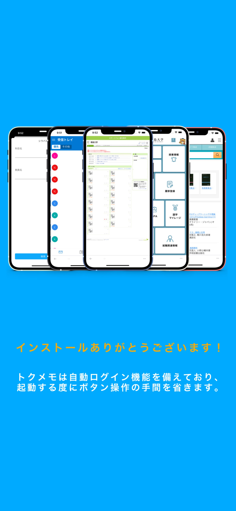
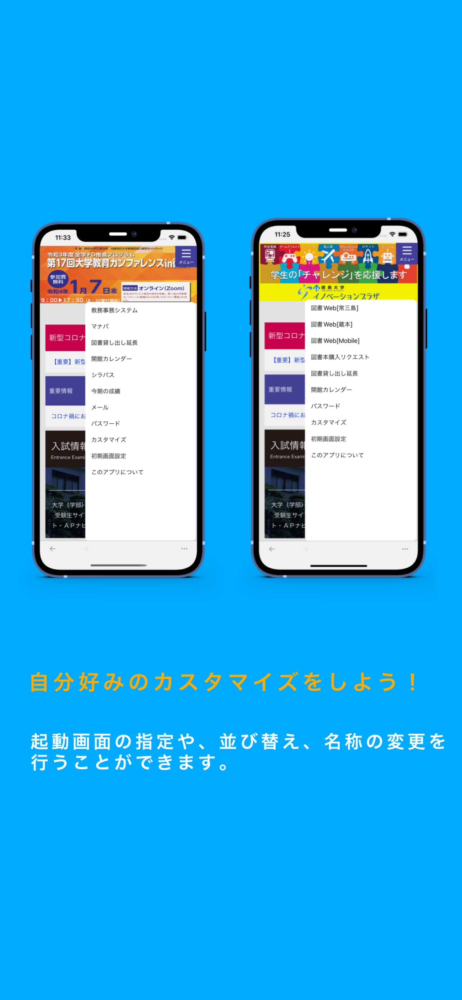
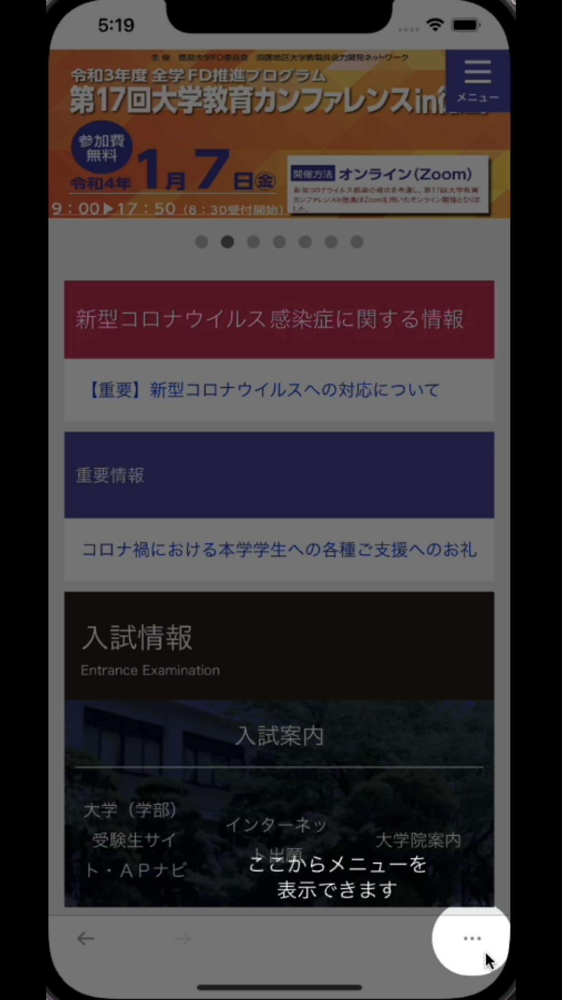
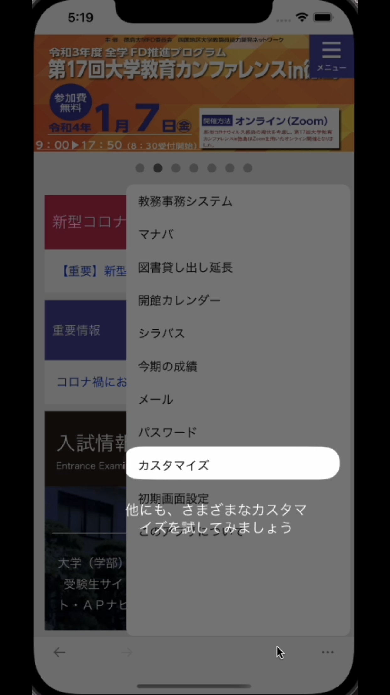
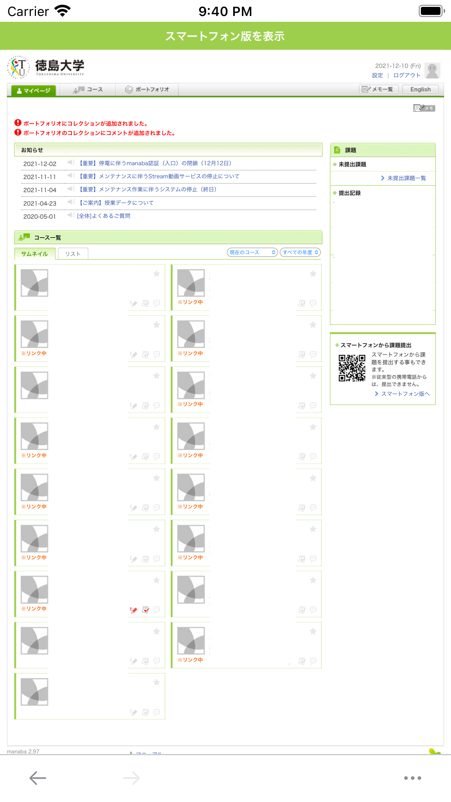
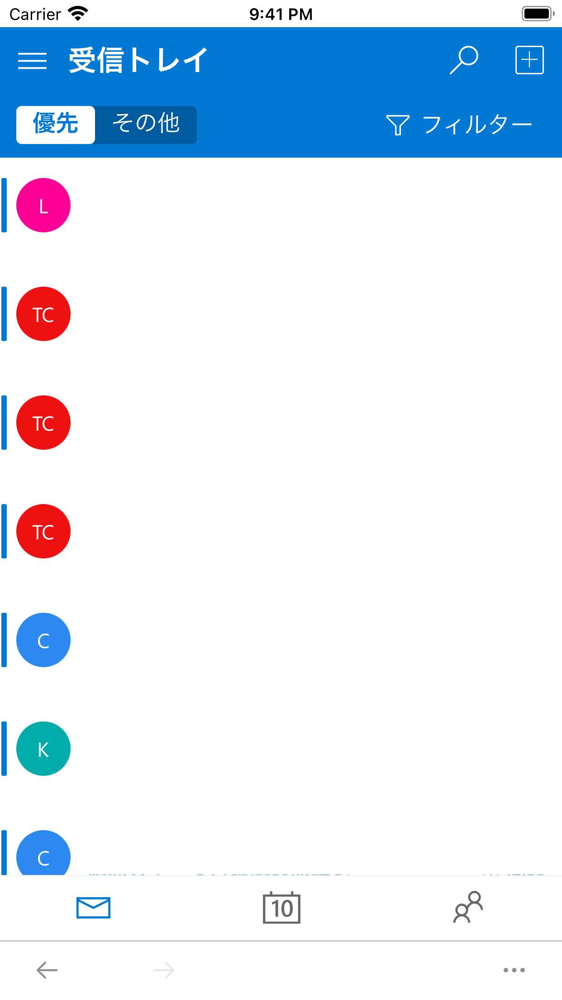
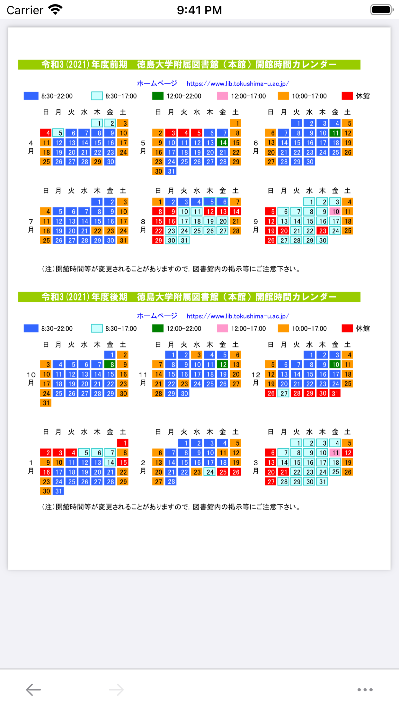
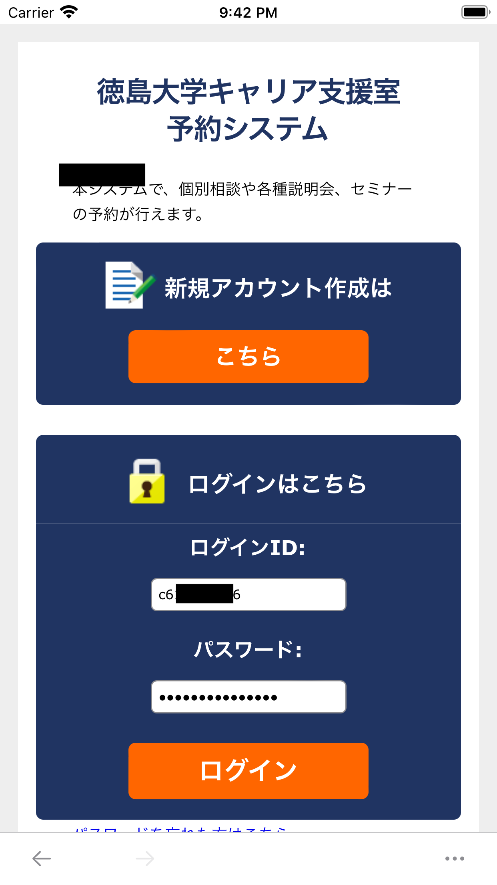
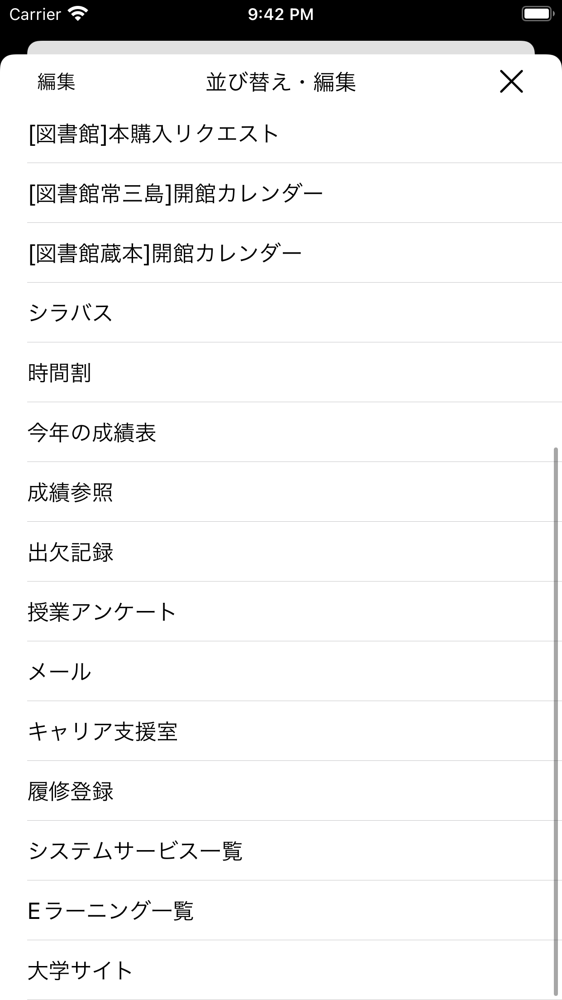
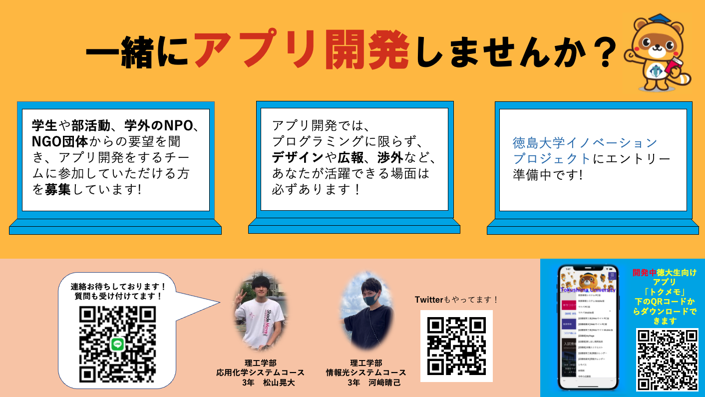

# Tokumemo-iOS

<!-- [](https://github.com/tokudai0000/univIP/release/latest) -->

[](https://github.com/tokudai0000/univIP/blob/main/LICENSE)
[](https://github.com/tokudai0000/univIP)
[](https://twitter.com/tokumemo0000)

|Branch|CI|
|:--|:--|
|[main](https://github.com/tokudai0000/univIP/tree/main)|[](https://github.com/tokudai0000/univIP/actions/workflows/main.yml)|
|[develop](https://github.com/tokudai0000/univIP/tree/develop)|[](https://github.com/tokudai0000/univIP/actions/workflows/main.yml)|

[](https://apps.apple.com/jp/app/id1582738889)


<p align="center" >
  
</p>


## 概要
トクメモは日々のパスワード入力、煩雑なボタンクリックを自動化する、徳島大学専用の学修サポートアプリです。
画面タップ回数をログイン時は3回->0回、成績参照時は11回->2回にまで減少させるなど学生の視点からあったらいいなを実現したアプリです。
現在、徳島大学イノベーションプロジェクトにエントリー準備中で、アプリ開発チームに参加していただける方を募集しています。
オープンソースのため、開発に参加することができます！


## スクリーンショット

|WalkThroughTutorial1|WalkThroughTutorial2|WalkThroughTutorial3|
|:--|:--|:--|
||||

|SpotlightTutorial1|SpotlightTutorial2|SpotlightTutorial3|
|:--|:--|:--|
||||

|教務事務システム|マナバ|Outlookメールサービス|
|:--|:--|:--|
||||

|図書館マイページ|図書館開館カレンダー|キャリア支援室|
|:--|:--|:--|
||||

|シラバス検索画面|パスワード入力画面|
|:--|:--|
|||

|提供サービス一覧1|提供サービス一覧2|
|:--|:--|
|||


## 環境

- [Xcode](https://apps.apple.com/jp/app/xcode/id497799835): 13.2.1
- [cocoaPods](https://cocoapods.org/): 1.11.2


## プロジェクト構成

- UI実装: Storyboard
- アーキテクチャ: MVVM
- ブランチモデル: Git-flow


## ビルド手順

1. プロジェクトのクローン

    ```shell
    $ git clone https://github.com/tokudai0000/univIP.git
    $ cd univIP
    ```

2. Cocoapodsの設定

    ```shell
    $ pod install
    ```

3. Xcodeを開く

**Xcode13以上で開く**

    ```shell
    $ open univIP.xcworkspace
    ```


## ライブラリ
- R.swift 
- Firebase/Analytics
- KeychainAccess // KeychainをUserDefautsのように操作する為に使用
- Kanna // Webスクレイピングを行う為に使用
- EAIntroView // ウォークスルー型チュートリアル生成の為に使用
- Gecco // スポットライト型チュートリアル生成の為に使用


## 機能一覧
- 教務事務システム、マナバ、outlookへの自動ログイン機能
- 時間制限による強制ログアウト対応
- カスタマイズメニューから大学のWebサービスへ遷移
- 図書館開館カレンダー、今期の成績について、動的URLをWebスクレイピング等をすることで取得し、表示
- シラバスの簡略検索
- メニューのカスタマイズ
- チュートリアルの表示


## 工夫点
毎日利用しやすいように工夫を重ねた。

### 1, タップ回数削減
学生の立場から使いやすい操作手順（タップ回数削減）に変更した。
例えば、「ログインするのに必要だったタップ回数を3回から0回へ」「成績参照までを11回から2回へ」など他にも工夫を重ねた。

### 2, 再ログイン機能
時間制限による強制ログアウトでエラーが発生し、改めてログインする必要があり面倒だったのを、自動でエラー回避した上でログインする様にした。

### 3, パスワード保存への信頼性
アプリの透明性をアピールする為、また同じ大学の仲間からアドバイスが受けられる様に、GitHubで公開した。
また、徳島大学イノベーションプラザの大学公認プロジェクトとして、広めれるよう現在調整中。

### 4, CI(継続的インテグレーション)の構築
GitHubActionsを使用し、XcodeのUnitTestを「main,develop」へプッシュされるたびに実行するように環境を整えた。

### 5, 保守性の向上
オープンソース、チーム開発をする上で、
コードの読みやすさ、言語やフレームワークの文化に沿ったコーディングスタイルを意識した。
また、適度にコメントを増やし3ヶ月後の自分でもわかる様、可読性を意識した。

### 6, コミットの粒度
正解の粒度はわからないが、自分自身がGitTreeを見た時に、何を変更したのかを理解できることを意識してコミットを行った。

### 7, 広報
認知度を広める為に、Twitterアカウントを稼働させた。
稼働後からの「トクメモ」ダウンロード数はこれにより向上した。
それ以外にも、ビラを作成し学内掲示板への掲示を行う予定。
[](https://twitter.com/tokumemo0000)

|ビラ|
|:--|
||

## 今後していきたい事
- 徳島大学イノベーションプラザのプロジェクト申請
- 他学生が運営しているWebサイトとの連携
- Android版の開発
- お問合せフォームの作成(APIの作成)
- iPadのサイズ対応
- 単体テスト等の充実 


## 統計

[](https://github.com/tokudai0000/univIP)


## 募集中

ご協力いただけると幸いです :)

- [New issue](https://github.com/tokudai0000/univIP/issues/new)
- [New pull request](https://github.com/tokudai0000/univIP/compare)


## 自己評価
リリース日(2021年9月2日)
リリースから数ヶ月が経過した。
初期に比べて、UI面ではシンプルなアプリに。
コード面でもコードリーディングを意識し続けている為、わかりやすいコードになっているのではないかと考える。

また、FireBase/Analyticsを導入した結果、毎日２〜7ユーザーが利用してくれている為、
使いやすいアプリとして認知されているのではないかと考える。

今後も、ユーザーから意見を求めて積極的に改善していきたいと思う。


## ライセンス

© 2021 akidon0000

トクメモは[MITライセンス](https://github.com/tokudai0000/univIP/blob/main/LICENSE)のオープンソースプロジェクトです。
