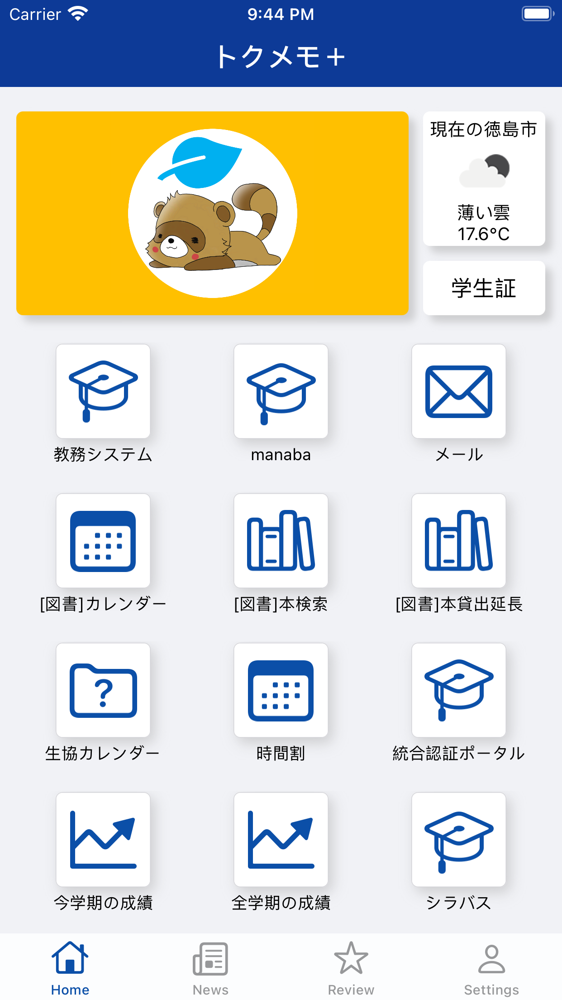
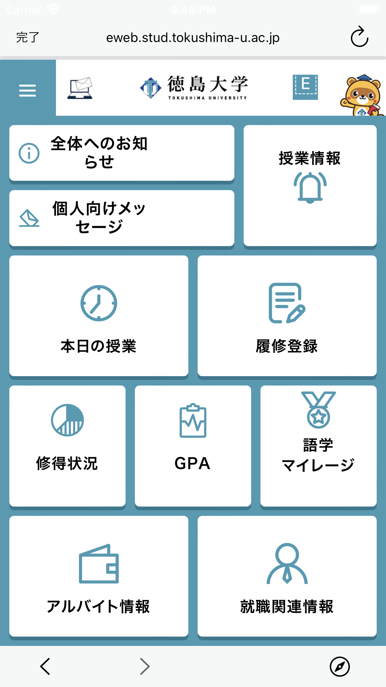
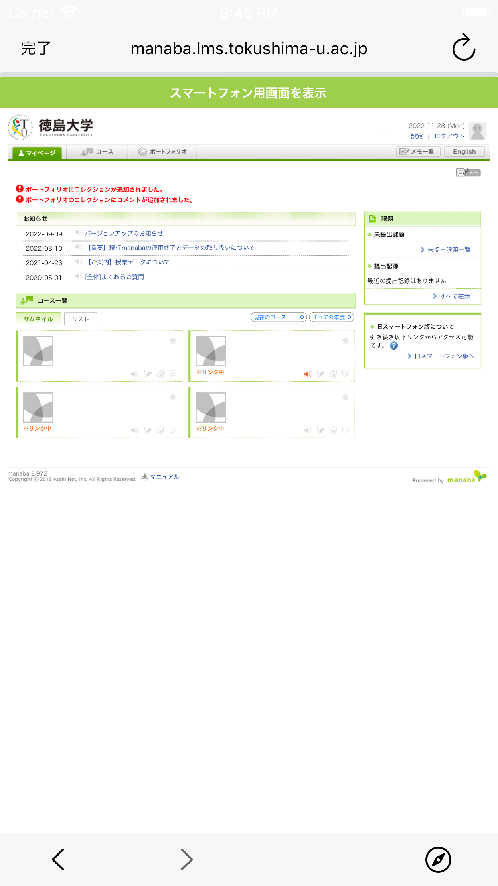
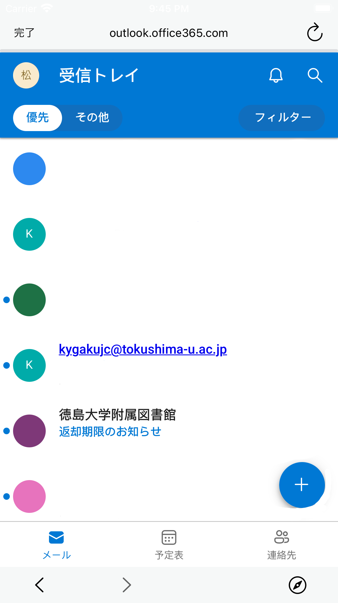
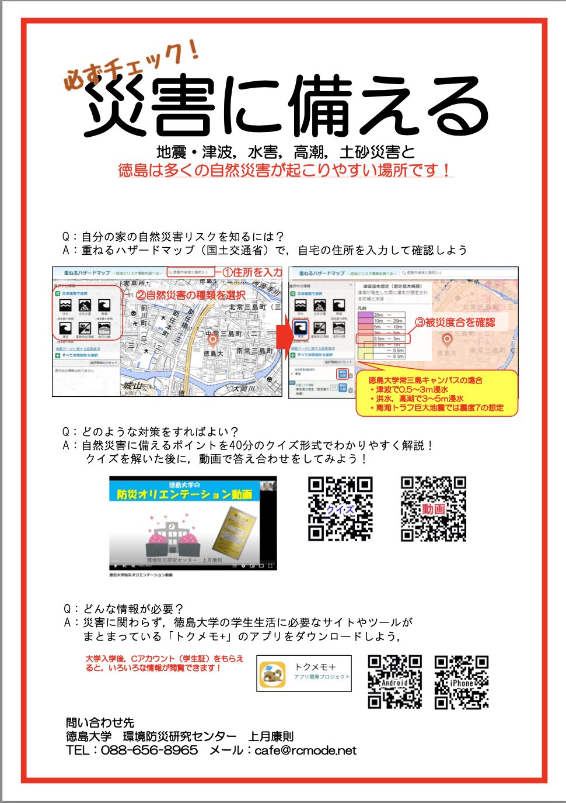
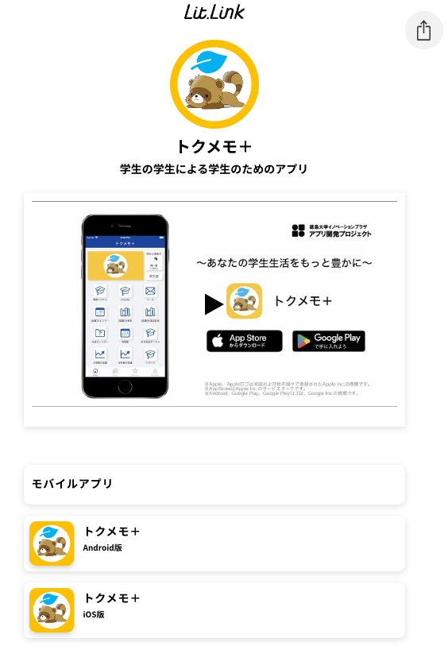

  

# トクメモ＋ (TokumemoPlus) for iOS

|Branch|CI|
|:--|:--|
|[main](https://github.com/tokudai0000/univIP/tree/main)||
|[develop](https://github.com/tokudai0000/univIP/tree/develop)||

# 概要
トクメモ＋は、[ある徳島大学生](https://github.com/akidon0000)が徳島大学のWebサービスの不便さを解消する目的で個人開発したアプリ「トクメモ」が原点です。
本アプリは、徳島大学の講義情報やレポート提出、そして学内情報などの一元化を目的としており、それにはJavaScriptインジェクション、Webスクレイピング、そしてRSSフィードを活用し、学生生活のほとんどが一つのアプリで完結するという形で実現しました。

現在、AppStoreとGooglePlayで公開しています。[利用者数](https://github.com/tokudai0000)はこちらをご覧ください。

開発では、大学側がAPIを提供していないため、WebスクレイピングとJavaScriptインジェクションを用いて情報収集を行いました。
具体的に、Webスクレイピングでは図書館の開館表がpdfとしてHTMLのボタン内に埋め込まれています。開館表に修正が入ったとしても対応させました。
また、JavaScriptインジェクションでは、SSOのSAML認証を行うログイン画面にてIDとパスワード、次へ進むボタンの3つをモバイル側からWebページ側へJavaScriptを送り実行させることで自動化させました。

# 紹介動画

※Youtubeへ遷移します

# スクリーンショット

|ホーム画面|ニュース画面|設定画面|教務事務システム|マナバ|
|:--|:--|:--|:--|:--|
||||||

|Outlookメールサービス|パスワード画面|カスタマイズ画面|
|:--|:--|:--|
||||

# 機能紹介

### 主要機能
- 大学Webサービス（manaba、教務システムなど）への自動ログイン
- 18種類の大学Webページへの簡単アクセス
- 徳大Newsの閲覧
- 徳大の学生団体情報の集約
- 徳島大学生に向けて、先生や学生達が情報発信できる機能

### 機能詳細

#### 大学Webサービス（manaba、教務システムなど）への自動ログイン
- manabaや教務システムなど、大学Webサービスへ簡単にアクセスできます。お気に入りから探す手間が省け、ログイン済みの状態でページが開くことが出来ます。

#### 18種類の大学Webページへの簡単アクセス
- 忙しい朝に教務、manaba、メールなどを素早く開いて大学からのお知らせをチェックできます。システム間の移動もボタン一つでスムーズに行えます。

#### 徳大Newsの閲覧
- 徳島大学のホームページに掲載されているNewsをアプリで確認できます。これで徳大の最新情報を逃さずチェックできます。

#### 徳大の学生団体情報の集約
- 徳島大学で活動する部活動・サークル・学生団体についての情報を一箇所で確認できます。これにより、学生団体の活動やイベントに関する情報を簡単に入手できます。

#### 徳島大学生に向けて、先生や学生達が情報発信できる機能
- 学生が主導で運営している[StudySupportSpace](https://www.lib.tokushima-u.ac.jp/support/sss/index.html)についての情報機能を追加
- 社会基盤コースの先生から依頼を受け、徳島大学生に向けて[知っておきたい防災](https://www.tokushima-u.ac.jp/rcmode/business/46584.html)についての情報機能を追加

# 活動履歴
詳細は[こちら](https://github.com/tokudai0000)を参照してください。

|2021/11 メンバー募集ビラ|2021/12 アプリ広報ビラ_1|2021/12 アプリ広報ビラ_2|
|:--|:--|:--|
||||

|2022/11 アプリ広報ビラ|2023/4 新入生向けアプリ広報ビラ|
|:--|:--|
|||

# 開発

## 動作確認環境
- Xcode 14.2
- iOS 15.0
- cocoapod 1.12.1

## 使用ライブラリ
- [R.swift](https://github.com/mac-cain13/R.swift)
- [Alamofire](https://github.com/Alamofire/Alamofire)
- [SwiftyJSON](https://github.com/SwiftyJSON/SwiftyJSON)
- [KeychainAccess](https://github.com/kishikawakatsumi/KeychainAccess)
- [Kanna](https://github.com/tid-kijyun/Kanna)
- Firebase-Analytics

## 募集中

ご協力いただけると幸いです :)

- [New issue](https://github.com/tokudai0000/univIP/issues/new)
- [New pull request](https://github.com/tokudai0000/univIP/compare)

## ライセンス

Copyright(c) 2023 tokudai0000

トクメモ＋は[MITライセンス](https://github.com/tokudai0000/univIP/blob/main/LICENSE)のオープンソースプロジェクトです。

## ホームページ

※画像をタップすると遷移します
